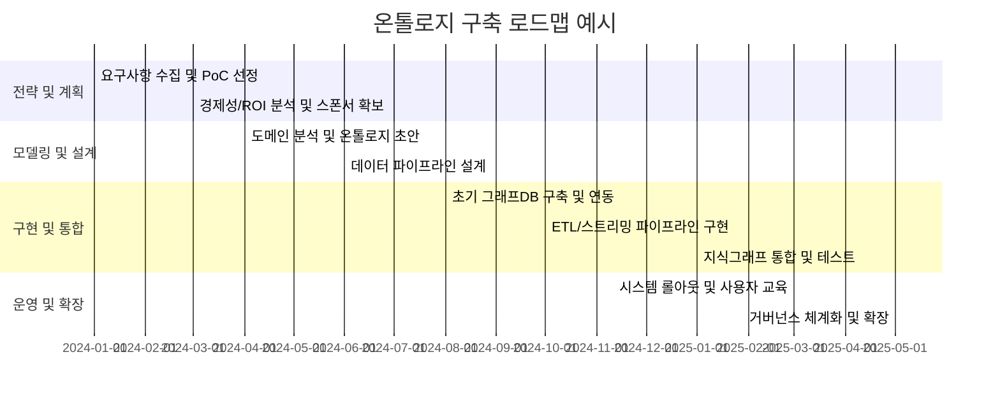

# 요약

데이터 파이프라인에 온톨로지를 도입하면 **서로 다른 시스템과 부서 간의 데이터 언어 불일치**를 해소하고, 데이터의 **의미론적 통합**과 **재사용성**을 높일 수 있다【49†L68-L74】【16†L7-L10】. 예를 들어 같은 기업 내에서 “고객” 개념이 영업·재무·생산 부서마다 다르게 정의되어 있으면 AI 분석 결과는 신뢰도가 떨어진다【49†L68-L74】. 온톨로지는 이러한 문제를 해결하기 위해 비즈니스 개념과 관계를 **공통 용어 사전(지식 지도)** 형태로 명시하여 데이터의 의미를 표준화한다【49†L99-L104】【47†L10-L13】. 그 결과 데이터 품질과 상호운용성이 개선되고, 중복 작업 감소 및 자동화가 가능해진다【16†L7-L10】【45†L422-L429】. 

실제 사례에서도 온톨로지 기반 접근의 효과가 입증되었다. 미국 식품회사 **타이슨 푸드(Tyson Foods)**는 팔란티어의 온톨로지 플랫폼을 통해 공급망 데이터를 통합해 디지털 트윈을 구축한 뒤, 2년간 20여 개 혁신 프로젝트를 진행하며 **연간 2억 달러**의 비용 절감을 달성했다【19†L1-L4】. **아마존(Amazon)**은 AutoKnow 시스템으로 수십억 개 상품의 카테고리와 속성을 자동 추출하여 제품 지식 그래프를 구축·관리함으로써 대규모 데이터 통합 및 분류 작업을 자동화했다【22†L250-L258】【22†L259-L261】. 국내에서도 **DB손해보험**이 티쓰리큐와 온톨로지 기반 AI를 활용한 보험 청구 자동화를 추진하는 등 금융·헬스케어·제조·전자상거래 등 다양한 산업에서 온톨로지 활용 사례가 속속 등장하고 있다【25†L21-L28】【45†L422-L429】. 

이 보고서에서는 온톨로지 도입의 비즈니스·기술적 필요성, 산업별 성공 사례, 온톨로지 기반 데이터 파이프라인 아키텍처, 구현 로드맵 및 실행 가이드, 결론 및 권고안을 종합적으로 제시한다. 먼저 데이터 파이프라인에서 온톨로지가 해결하는 **문제 정의**와 기대 효과(데이터 품질·상호운용성·거버넌스·자동화 등)를 분석하고【49†L68-L74】【16†L7-L10】, 다양한 사례를 통해 정량적 성과를 살펴본다【19†L1-L4】【22†L250-L258】. 이어서 논리/물리 계층, 메타데이터 관리, ETL/ELT 통합, 실시간 스트리밍, 지식 그래프, API/서비스, 보안·거버넌스 관점에서 온톨로지 기반 아키텍처를 설계하고, RDF/OWL, SPARQL, 그래프 DB, Kafka, Airflow, dbt 등의 기술 스택을 장단점 비교 표로 정리한다【31†L179-L187】【35†L154-L163】. 마지막으로 단계별 마일스톤과 조직·역할·역량 구성, 모델링·온톨로지 설계 방법론, 도구·테스트·검증, 유지보수·버전관리, 비용 추정(기업 규모별) 등을 포함한 실행 로드맵을 제시한다【52†L334-L340】【56†L346-L354】. 

## 1. 도입 배경 및 기대효과 

### 1.1 문제 정의: 비즈니스·기술·운영 관점 

- **데이터 사일로 및 용어 불일치**: 기업마다 서로 다른 시스템이 각기 다른 용어를 사용해 데이터를 생성·저장하면, 같은 개념(예: “고객”)의 정의가 부서마다 달라진다【49†L68-L74】. 실제 제조·건설·유통 현장에서는 “재고”나 “진행률”이 부서별로 해석 기준이 달라 AI 분석 결과가 엉뚱해지는 사례가 빈번하다【49†L68-L74】【47†L30-L34】. 이러한 불일치는 **AI의 컨텍스트 이해를 방해**하고, 결과적으로 분석 인사이트의 신뢰도를 떨어뜨린다. 

- **데이터 통합의 어려움**: ERP, CRM, MES, IoT 등 이기종 시스템의 데이터가 유기적으로 연계되지 못하고 단절되어 있으면 ‘나비 효과(Butterfly Effect)’처럼 작은 변화가 전체 비즈니스에 큰 영향을 미칠 수 있지만 이를 예측·분석하기 어렵다【18†L43-L51】【49†L68-L74】. 예를 들어 타이슨 푸드는 팬데믹 당시 흩어져 있던 데이터 간 인과관계를 파악할 수 없어 공급망 위기를 겪었지만, 온톨로지로 데이터를 연결해 나비 효과를 예측 가능한 형태로 바꾸었다【18†L49-L53】【19†L1-L4】.  

- **자동화 및 AI 한계**: 기존의 LLM이나 딥러닝 모델은 데이터의 통계적 상관관계는 파악해도, 비즈니스 도메인의 **명시적 의미와 논리적 관계**까지 이해하지 못한다【47†L43-L50】【49†L68-L74】. AI 프로젝트가 수십억 달러 투입에도 성공률이 5% 미만인 이유로, **데이터 의미(semantics)의 부재**가 지목된다【47†L10-L13】. 즉, 표준화된 온톨로지 없이는 AI가 부서 간 의미 차이로 인해 잘못된 결론을 내리고, 환각(hallucination)을 일으킬 위험이 있다【47†L10-L13】【49†L68-L74】. 

- **운영 및 거버넌스 문제**: 온톨로지는 단순한 데이터 사전이 아니라 **비즈니스 정책·규칙을 포함한 지식 모델**이므로 잘 설계되지 않으면 운영 오버헤드와 조직적 갈등이 발생할 수 있다. 부서 간 용어 합의, 온톨로지 업데이트를 위한 거버넌스 체계 등이 마련되지 않으면 애초의 목표를 달성하기 어렵다. 이에 대한 현실적 고려사항은 초기 구축에 상당한 **시간(3~6개월)**과 **비용(그래프DB 인프라, 운영 인력)**이 소요된다는 점이다【52†L334-L340】. 

### 1.2 기대효과: 품질·상호운용성·거버넌스·재사용성 등 

온톨로지를 데이터 파이프라인에 도입하면 다음과 같은 효과를 기대할 수 있다:

- **데이터 품질 및 정확도 향상**: 온톨로지 기반 모델을 통해 데이터의 정합성을 검사하고 오류를 탐지할 수 있다. 예를 들어 의료 분야에서는 온톨로지를 활용해 임상 규칙과 용어를 통일함으로써 **오류 감소 및 처리 지연 단축**이 가능하다. 실제 사례로, 의료 AI 시스템 도입 시 온톨로지 프레임워크를 적용하면 *“의료 오류 30% 감소, 평균 재원일수 2일 단축”* 등을 성공 기준으로 설정할 수 있다【15†L1-L4】【16†L7-L10】. 이는 환자 안전과 비용 절감으로 직결되는 성과다. 

- **상호운용성 및 통합 강화**: 서로 다른 데이터 소스와 스키마를 온톨로지라는 **공통 언어(Semantic Layer)**로 연결하면, 시스템 간 연계가 원활해진다【31†L179-L187】【45†L392-L400】. RDF/OWL 기반 그래프 모델은 이질적 데이터의 메타데이터 관리와 마스터 데이터 통합에 유연하게 대처할 수 있으며, 글로벌 URI 사용으로 외부 데이터와 연계하기도 쉽다【31†L179-L187】. 이를 통해 조직 전반의 데이터 사일로를 해체하고 **360° 통합 뷰**를 제공할 수 있으며, 결과적으로 기업 자산에 대한 종합적 인사이트가 강화된다【45†L422-L429】. 

- **재사용성과 확장성 개선**: 온톨로지는 한번 구축해 두면 다양한 응용에서 재사용이 가능하다. 명확하게 정의된 개념과 관계는 새로운 데이터나 서비스가 추가될 때도 일관된 방식으로 확장할 수 있게 해준다【16†L7-L10】【52†L334-L340】. 예를 들어 온톨로지 기반 제품 라이브러리 사례에서는 *“유연한 데이터 모델로 비즈니스 요구에 따라 확장 가능”*하도록 설계함으로써, 신규 제품 등록이나 글로벌 표준 추가 시에도 손쉽게 대응할 수 있었다【45†L392-L400】. 

- **자동화와 지능화 지원**: 명시적 개념 모델을 통해 자동화 파이프라인을 설계할 수 있다. 예를 들어 카프카(Kafka) 스트리밍으로 수집된 이벤트를 온톨로지와 연계하면 실시간 데이터 통합이 용이해지며, ETL 도구(Airflow·dbt 등)와 결합해 규칙 기반 검증과 자동화 변환을 수행할 수 있다. 미국의 경우, **온톨로지는 AI 시스템의 ‘가드레일(guardrail)’** 역할을 수행하여 AI가 의미 없는 추론을 하는 것을 막아준다고 전문가들은 강조한다【49†L99-L104】【47†L10-L13】. 

- **데이터 거버넌스 강화**: 온톨로지는 데이터 계보(프로비넌스)·품질·정책을 포함한 거버넌스 체계의 핵심 인프라가 된다. 메타데이터 리포지토리와 온톨로지를 결합하면 데이터 사용 이력을 추적하고, 정책 기반 접근 제어가 가능해진다. 또한 공리(Axioms/Rules) 형태로 비즈니스 규칙을 명시하면 자동화된 정책 집행(예: **“결제 완료 전 배송 불가”** 등)을 할 수 있다. 이는 컴플라이언스와 규제 대응에 있어 큰 강점으로 작용한다. 

이처럼 온톨로지를 도입하면 데이터 품질, 상호운용성, 재사용성, 자동화 등의 다차원적 효과를 얻을 수 있다. 반면 초기 구축에는 전문 인력·도메인 지식·시간과 예산 투자가 필요하므로, 조직 규모와 우선순위에 따라 단계적 접근이 필수적이다【52†L334-L340】. 

## 2. 성공 사례 및 벤치마크

다양한 산업과 기업에서 온톨로지 기반 데이터 파이프라인이 도입되어 구체적 성과를 거두었다. 주요 사례는 다음과 같다.

- **금융**: 금융업에서는 FIBO*(Financial Industry Business Ontology)* 같은 표준 온톨로지를 활용해 투자·자산·규제 데이터를 통합하는 시도가 진행되고 있다【12†L1-L4】. 국내에서는 DB손해보험이 티쓰리큐와 *온톨로지 기반 AI*를 활용한 장기보험 보상청구 자동화를 추진 중이다【25†L21-L28】. 이 사례는 고객 정보와 계약·청구 데이터를 통합 지식그래프로 관리하여 청구 프로세스의 정확도와 속도를 높이고자 한다. 금융권은 복잡한 상품·규제 도메인을 모델링할 수 있는 온톨로지 도입이 **리스크 관리와 의사결정 신뢰성** 개선으로 이어지는 분야다. 

- **의료·헬스케어**: 의료 분야에서도 온톨로지 활용이 활발하다. 복잡한 임상 진단·처방 지식을 온톨로지로 체계화하면, 다부서 협업 시 잘못된 처방이나 중복 검사를 줄일 수 있다. 예를 들어 의료 AI 혁신에서 온톨로지 프레임워크를 적용하면 임상 데이터의 **명확성(Clarity), 공유이해(Shared Understanding), 재사용성(Reusability)** 등이 강화되어 의료 오류를 줄이고 시스템의 지속 학습이 가능해진다【16†L7-L10】. 한편 온톨로지를 통한 정형화로 의료 이미지·EMR 등의 비정형 데이터를 정규화하는 시도도 진행 중이다. 실제로 한 의료기관은 *“의료 오류 30% 감소, 평균 재원일수 2일 단축”*을 목표로 온톨로지 기반 AI 시스템을 개발하고 있으며【15†L1-L4】, 이는 초기 단계임에도 기대 효과를 정량적으로 제시한 예시로 평가된다. 

- **제조·공급망**: 제조업과 공급망 관리 분야에서는 온톨로지를 이용한 디지털 트윈과 최적화 사례가 주목받고 있다. 미국 식품기업 타이슨 푸드는 팔란티어 온톨로지로 공급망 현황을 통합 관리하여 *‘나비 효과’를 계산 가능한 문제*로 전환했다. 이를 통해 타이슨은 2년간 20여 개 혁신 프로젝트를 완료하며 **연간 2억 달러**의 비용 절감을 달성했다【19†L1-L4】. 유럽의 한 전기부품 제조사는 Ontotext GraphDB를 이용한 제품 지식그래프를 구축하여 **360° 제품 뷰**를 실현했다【45†L337-L345】【45†L422-L429】. 이 사례에서는 이질적 제품 정보를 하나의 온톨로지로 통일·표준화하여, 제품 검색성과 품질 관리, 파트너 간 통합을 크게 개선했다. 결과적으로 *“제품 정보의 발견 가능성이 높아져 시장 포지션이 개선”*되는 등 제조 프로세스의 생산성과 유연성이 향상되었다【45†L422-L429】. 

- **전자상거래 및 서비스**: 대형 온라인 업체들은 상품·고객·행동 데이터의 복잡한 지식을 온톨로지와 지식 그래프로 관리한다. 아마존은 AutoKnow 시스템으로 쇼핑몰 상품 데이터를 *전수 조사*하여 제품 지식그래프를 자동 생성·운영한다【22†L250-L258】. 이 시스템은 상품명과 리뷰에서 속성을 추출하고, 불가능한 데이터(예: “100톤짜리 노트북”)를 검출하는 등 **자동 분류·정제 기능**을 수행한다【22†L254-L261】. AutoKnow 사례는 온톨로지 구축이 *대규모로 자동화 가능*함을 증명한다【22†L259-L261】. 또한 Graphrag 커뮤니티에 따르면, 전자상거래의 핵심은 온톨로지 기반의 **공유된 시맨틱 계약(semantic contract)**이며, 이를 통해 대규모 파트너 네트워크 간의 경계를 넘어 데이터가 연계될 수 있다【27†L38-L44】【27†L86-L90】. 

- **기술·서비스 기업 사례**: 구글, 링크트인 등의 기술기업은 내부적으로 지식 그래프와 온톨로지 기술을 활용하여 데이터 플랫폼을 구축해 왔다. 링크트인은 직무·스킬·회사 정보를 모델링한 지식 그래프를 기반으로 AI 추천의 정확도를 **78% 향상**시킨 사례가 알려져 있다(사례: “LinkedIn’s Knowledge Graph Boosts AI Accuracy by 78% with RAG”), 이는 온톨로지가 추천 시스템 개선에 기여했음을 시사한다(관련 블로그 참조). 구글은 Schema.org와 UCP(Universal Commerce Protocol) 등 오픈 표준을 통해 웹·상거래 데이터를 시맨틱하게 구조화하여 검색과 AI 에이전트를 위한 **공유 에이전시 환경** 구축을 지원하고 있다【27†L130-L139】【27†L142-L147】. 오픈소스 측면에서는 Ontotext의 GraphDB나 Apache Jena, Stardog 등의 RDF 플랫폼이 풍부한 사례를 제공한다. Ontotext는 제약·생명과학 분야의 타겟 디스커버리 등에 지식그래프 솔루션을 제공해 왔으며, 위의 제조업 사례에서도 사용된 바 있다【45†L392-L400】【45†L422-L429】. 

**성공사례 요약 테이블** 

| 구분           | 기업/기관 (산업)          | 도입 배경 및 구현 방식                       | 성과 (정량적 지표)                              | 주요 교훈 및 특징                           |
|--------------|------------------------|-------------------------------------------|---------------------------------------------|------------------------------------------|
| Tyson Foods (팔란티어) | 식품 공급망 (제조)        | 분산된 공급망 데이터 통합, 온톨로지 디지털 트윈 구축     | 2년간 20개 혁신 프로젝트, **연간 $200M 비용 절감**【19†L1-L4】 | **데이터 사일로 해체**로 실시간 예측·통제 가능. 복합 인과관계를 온톨로지로 모델링. |
| Amazon (AutoKnow) | 전자상거래             | 상품 카탈로그·리뷰 자동 분석→제품 지식그래프 생성     | 수십억 상품 속성 자동 추출·분류, **지식그래프 대규모 자동화**【22†L250-L258】【22†L259-L261】 | 딥러닝+온톨로지로 **자동화된 카테고리화**. 높은 확장성과 효율성 입증.            |
| DB손해보험 (티쓰리큐) | 보험 (금융)              | 보험 청구 데이터 통합, 온톨로지 AI 기반 자동화 추진    | (PoC 진행 중) 보험 청구 프로세스 **자동화 가속화** 및 고객 경험 개선 기대 | 보험 도메인 온톨로지 개발로 복잡한 규제/청구 로직 자동 처리.                 |
| (연구기관 사례) Healthcare N/A   | 의료·제약 (의료)        | EMR·임상 데이터 통합, 의료 지식온톨로지 활용 AI        | (목표) 의료 오류 30%↓, 재원일 2일↓【15†L1-L4】      | **임상 절차 표준화**와 데이터 정제로 질적 개선. 의료진 공통 언어화 필요.        |
| European Manufacturer (Ontotext) | 전자부품 (제조)        | 다양한 제품 정보 통합, GraphDB 기반 제품 라이브러리 구축 | 360° 제품 포트폴리오, **메타데이터로 정보 검색성 대폭 향상**【45†L392-L400】【45†L422-L429】 | 이종 데이터(도면, 매뉴얼 등) 유연한 그래프로 통합. **자연어 쿼리 지원** 등 사용자 편의성 강화. |
| Google/LinkedIn (사례 발췌) | IT·플랫폼                | 지식그래프 기반 검색/추천, AI 에이전트 도입         | LinkedIn: RAG기반 추천 정확도 78% 향상 (사례)        | 대규모 사용자·스킬 데이터 모델링. **에이전시 환경** 구축을 위한 공유 온톨로지 필요. |

각 사례는 **온톨로지로 데이터의 의미와 관계를 명시화**하여 상기 지표 개선을 이끌어냈음을 보여준다【19†L1-L4】【22†L250-L258】【45†L392-L400】. 특히 비즈니스 임팩트를 수치로 확인할 수 있는 Tyson, Amazon 사례는 온톨로지 도입의 ROI를 극명히 드러낸다. 

## 3. 아키텍처 설계 및 기술 스택 비교 

데이터 온톨로지 기반 파이프라인 아키텍처는 여러 계층으로 구분된다. 데이터 소스에서부터 온톨로지·지식그래프 구축, 서비스·API 계층에 이르기까지 전 과정이 유기적으로 연결되어야 한다. 

【53†embed_image】 *그림: 온톨로지 기반 데이터 파이프라인의 개념적 아키텍처 예시 (자료: 저자 구성)*  

### 3.1 논리·물리 계층 구조 

- **데이터 소스 계층**: 기존 RDB, NoSQL, 파일, 스트리밍 로그, 외부 API 등 다양한 데이터 출처. 이질적 형식과 스키마를 가진 데이터를 수집한다.  
- **메타데이터/온톨로지 계층**: 온톨로지를 저장·관리하는 중앙 리포지토리. RDF/OWL 같은 지식표현 언어로 개념(Class), 관계(Property), 공리(Axiom)를 정의한다. 이 계층은 논리적으로 데이터 자산의 공유 어휘(vocabulary)와 스키마 역할을 한다.  
- **ETL/ELT 처리 계층**: 데이터 파이프라인 오케스트레이션 도구(Airflow, dbt 등)를 통해 원시 데이터를 정제하고, 온톨로지 기반 규칙에 따라 그래프 DB로 적재한다. 배치 처리뿐 아니라 필터링·조인·변환 작업을 수행한다.  
- **실시간 스트리밍 계층**: Kafka, Pulsar 등 이벤트 스트리밍 플랫폼을 이용해 실시간 데이터를 처리한다. 스트림 처리 애플리케이션(Kafka Streams, Flink 등)이 데이터 이벤트에서 엔터티/관계를 추출하여 온톨로지와 연계된 지식 그래프에 업데이트한다【33†L521-L529】.  
- **지식 그래프/스토리지 계층**: RDF 트리플 저장소(GraphDB, Virtuoso, Amazon Neptune 등) 또는 속성 그래프 DB(Neo4j, TigerGraph 등)에 데이터와 온톨로지를 저장한다. 온톨로지 기반의 연결망 구조로 데이터를 모델링해 시맨틱 쿼리(SPARQL)와 그래프 알고리즘을 지원한다.  
- **API/서비스 계층**: GraphQL/SPARQL 엔드포인트, REST API, LLM 통합 RAG(검색증강생성) 서비스 등을 제공하여 외부 시스템과 사용자 인터페이스가 지식 그래프에 접근할 수 있도록 한다. 이 계층은 인증·인가, 쿼리/응답 레이트 제한 등 보안·거버넌스 기능을 포함한다.  

### 3.2 메타데이터 관리 및 통합 

메타데이터 관리 시스템(MDM)이나 데이터 카탈로그와 온톨로지를 연계하면 데이터 자산에 대한 정량적 지식과 설명이 결합된다. 예를 들어 **메타데이터 스튜디오** 같은 도구는 비정형 텍스트에 자동 태깅을 적용하여 온톨로지와 매핑하고, **SHACL** 같은 표준으로 데이터 무결성을 검증할 수 있다. 온톨로지 계층에서는 각 데이터 필드가 온톨로지의 개념에 매핑되고 관계가 부여되므로, 메타데이터 카탈로그는 개념 기반 인덱스를 제공하게 된다.  

### 3.3 실시간 스트리밍과 이벤트 처리 

Kafka를 중심으로 한 스트리밍 파이프라인을 통해 실시간 데이터를 온톨로지와 결합할 수 있다. 예를 들어, 복렌(Bakdata) 사례에서와 같이 실시간 택시 데이터를 Kafka Streams로 집계하고, 엔티티 관계를 계산한 후 Neo4j에 전달하여 지식그래프를 업데이트했다【33†L521-L529】. 그래프 DB 단독으로는 방대한 실시간 업데이트에 한계가 있으므로, Kafka와 같은 이벤트 스트리밍 플랫폼을 이용해 전처리·집계 로직을 분산 처리하는 것이 효과적이다【33†L521-L529】. 이렇게 하면 복잡한 지표(예: 엔티티 공출현 빈도 등)를 그래프 외부에서 미리 계산하여 반영할 수 있다.  

### 3.4 보안·거버넌스 

온톨로지 기반 파이프라인에서도 데이터 접근 제어와 거버넌스가 중요하다. 그래프 DB에서는 각 트리플에 대해 세분화된 권한을 설정할 수 있고, SPARQL 프로토콜의 프라이버시 레이블을 이용해 민감 정보를 마스킹할 수 있다. 또한 데이터 릭스 방지를 위해 **RDF/OWL 메타데이터**로 데이터 기여자와 주권을 관리하며, **Audit 로깅**으로 데이터 변경 이력을 추적한다. 

### 3.5 기술 스택 옵션 비교

온톨로지 파이프라인 구축 시 선택 가능한 주요 기술 스택을 비교하면 다음과 같다:

| 컴포넌트        | 옵션                          | 장점                                               | 단점                                               |
|---------------|-----------------------------|--------------------------------------------------|--------------------------------------------------|
| **데이터 모델링**  | RDF/OWL                       | ● 자체 기술(self-describing)로 메타모델 포함 관리【31†L175-L184】   ● SHACL 검증 및 OWL 추론 지원 (논리적 추론)【31†L175-L184】【31†L191-L194】   ● 이기종 스키마 정렬·연계에 유리【31†L179-L184】 | ● 학습 곡선이 높아 모델링 복잡【31†L195-L203】   ● n-ary 관계 표현이 불편 (중간개체 필요)【31†L195-L203】   ● OWL 구현 방법이 다양해 혼란 가능【31†L195-L203】 |
|               | 속성 그래프(Property Graph) | ● 대용량·빈번 갱신 데이터 처리에 효율적【31†L214-L223】   ● 친숙한 Cypher/SQL 유사 쿼리 (개발 생산성 높음)【31†L214-L223】   ● 그래프 알고리즘 라이브러리 풍부【31†L214-L223】 | ● 공식 표준 스키마 지원 미흡(형식적 검증 어려움)【31†L227-L234】   ● 벤더 종속성 위험(이식성 낮음)【31†L227-L234】   ● 네이티브 추론 미지원(논리적 상속·추론 한계)【31†L227-L234】 |
| **쿼리 언어**   | SPARQL                        | ● RDF 온톨로지와 표준화된 호환성   ● 복잡한 서술 쿼리(패턴 매칭)에 강함 | ● 익숙도 낮음, 초기 학습 필요   ● 일부 그래프DB에 최적화 문제 |
|               | Cypher/Gremlin (LPG)         | ● 개발자 친숙 (SQL-like)   ● 패턴 매칭 및 그래프 탐색 강점 | ● RDF만큼의 시맨틱 검증 기능 미지원   ● 이식성은 Cypher 표준화 미흡 |
| **그래프 DB**    | GraphDB/Virtuoso/Neptune 등 (RDF) | ● 표준 RDF 트리플 스토어로 SPARQL 지원   ● 지식그래프 관리 특화 (OWL 추론 엔진 내장) | ● 대용량 처리 시 성능 고려 필요   ● 라이선스 비용/스케일링 문제 고려 |
|               | Neo4j/TigerGraph/Arango (LPG) | ● 고성능 그래프 연산/분석 라이브러리   ● ACID 지원, 실시간 탐색 효율 | ● 스키마 강제 규정 미흡(데이터 거버넌스 부담)   ● 온톨로지 표현 제한 |
| **스트리밍**     | Kafka                         | ● 높은 처리량의 분산 메시징   ● 이벤트 기반 아키텍처로 유연   ● Kafka Connect로 다양한 시스템 연계 가능【33†L515-L523】 | ● 설정·운영 복잡성, 브로커 관리 필요   ● 순서 보장 및 중복 처리 고려 |
| **배치 Orchestration** | Apache Airflow               | ● DAG 기반 복잡 파이프라인 구현 용이   ● Python 기반 확장성, 다양한 커넥터 지원【35†L154-L163】   ● 오픈소스, 커뮤니티 활발 | ● 실시간 처리엔 부적합(스케줄 중심)【35†L162-L166】   ● 대규모 DAG 관리 시 병목, UI 한계 |
| **변환/모델링**  | dbt                           | ● SQL 중심 데이터 모델 정의   ● 테스트/버전관리 내장, 협업 용이 | ● 복잡한 비즈니스 로직 표현 제한   ● RDF 변환 지원 부족 |
|               | Custom Code (Python/R/JAVA)  | ● 유연한 처리 논리 구현   ● 범용성 높음 | ● 재사용·표준화 어려움   ● 유지보수 비용 증가 |
| **기타**        | SHACL/SHEx (검증)            | ● RDF 데이터 유효성 검증 표준   ● 온톨로지 준수 여부 검토 | ● 복잡한 검증설정 필요 | 
|               | GraphQL API                  | ● 계층형 데이터 질의에 최적   ● 프런트엔드/AI 연동 편의성 | ● 추상화 계층 추가로 복잡성 증가 |

위 비교표에서 알 수 있듯, **RDF/OWL 기반 접근**은 시맨틱 통합과 추론 능력이 뛰어나지만 도입 초기 학습과 모델링 비용이 크다【31†L175-L184】【31†L195-L203】. 반면 **속성 그래프**는 성능과 개발 생산성이 우수하나, 표준화된 거버넌스 지원이 상대적으로 약하다【31†L214-L223】【31†L227-L234】. 일반적으로 지식그래프 구축 시 RDF를 선호하나, 경우에 따라 Neo4j·TigerGraph 같은 LPG를 병행 사용하는 하이브리드 전략도 활용된다【31†L241-L249】. 파이프라인 오케스트레이션은 배치 중심인 Airflow를 많이 사용하며, 스트리밍 처리에는 Kafka를 결합하는 것이 널리 검증된 패턴이다【35†L154-L163】【33†L521-L529】. 이처럼 **구성요소별 도구**는 자사의 기술 역량, 데이터 특성, 실시간 요구 수준에 따라 선택해야 한다. 

## 4. 구현 로드맵 및 실행 가이드

온톨로지 기반 파이프라인 구축 프로젝트는 **단계별 계획**과 **전략적 접근**이 필수다. 다음은 조직 규모별 권장되는 로드맵과 고려사항이다. 

### 4.1 단계별 마일스톤

| 단계             | 주요 활동                                                 | 소규모 조직                                | 중규모 조직                                     | 대규모 조직                                            |
|----------------|--------------------------------------------------------|-----------------------------------------|--------------------------------------------|-----------------------------------------------------|
| **1단계: 전략 및 계획**  | - 요구사항 수집 및 ROI 분석 - 도메인 식별 - 파일럿 프로젝트 선정    | - 소규모 팀(1~2명) 구성, 클라우드 오픈소스 활용 - 1~2개월 내 PoC     | - 전담 TF 구성, 주요 이해관계자 협의 - 2~3개월 내 PoC 및 파일럿 수행      | - 전사 수준 워크숍, 사업단위 우선순위 수립 - 3~6개월에 걸친 PoC 및 파일럿 진행  |
| **2단계: 모델링 및 설계** | - 온톨로지·개념모델 설계 - 데이터 수집·정제 파이프라인 구축 - MVP 지식그래프 제작 | - 핵심 도메인 몇 가지 선정 - 3~6개월 온톨로지 정의 - 소규모 데이터 통합 | - 도메인 전문가 참여로 광범위 모델링 - 6~9개월 온톨로지 및 지식그래프 완성    | - 기업 표준 온톨로지 및 거버넌스 수립 - 6~12개월 다수 프로젝트와 병행 구축   |
| **3단계: 구현 및 통합**  | - 온톨로지 기반 ETL/스트리밍 파이프라인 구현 - 그래프DB 구축 및 연동 - QA/테스트 | - 단일 GraphDB 인스턴스 구축 - Airflow·dbt로 파이프라인 자동화 - 3~6개월 테스트 | - 멀티 인스턴스 및 하이브리드 환경 구축 - DataOps 프로세스 정립 - 6~12개월 운영 | - 엔터프라이즈급 인프라(클러스터) 구축 - 자동화·모니터링 체계 완비 - 12개월 이상 단계적 확장 |
| **4단계: 운영 및 확장** | - 시스템 롤아웃 및 모니터링 - 온톨로지 수정·확장, 사용자 교육 - 유지보수 계획 수립  | - 비공식적 거버넌스(소규모 회의 등) - 1년 차부터 추가 도메인 확장    | - 온톨로지 운영팀 구성 - 거버넌스 모델 도입(변경관리 프로세스) - 1~2년 차 확장 | - 전사 데이터 거버넌스 정책 연계 - 온톨로지 버전 관리 체계화 - 지속적 투자 검토 및 산출물 측정  |

### 4.2 조직·역할·역량 구성

- **프로젝트 조직**: 초기에는 데이터 엔지니어, 도메인 전문가, 지식 엔지니어(온톨로지 전문가), IT 운영 담당자로 소규모 팀을 구성한다. 중대형 조직은 별도의 온톨로지 팀이나 지식그래프 전문 부서를 둘 수 있다.  
- **역할**: 도메인 전문가들은 개념과 관계 정의에 참여하고, 데이터 엔지니어는 파이프라인 설계·구현, 지식 엔지니어는 온톨로지 설계·검증을 담당한다. CIO/CTO급은 전략 및 투자 결정을 지원해야 한다.  
- **역량 강화**: 온톨로지 설계, RDF/SPARQL 등 시맨틱 웹 기술 숙련이 필요하다. 초기에는 외부 컨설팅이나 교육(온톨로지 공학 워크숍, 그래프DB 튜토리얼 등)을 통해 역량을 확보하는 것이 효율적이다.

### 4.3 데이터 모델링·온톨로지 설계 방법론

온톨로지 설계에는 아래와 같은 방법론과 활동을 적용할 수 있다:

1. **도메인 분석**: 관계자 인터뷰, 기존 시스템 분석, 오용(Use Case) 도출을 통해 핵심 개념과 관계를 식별한다.  
2. **온톨로지 모듈화**: 상위 개념(예: 고객, 제품, 거래 등)을 독립 모듈로 설계하여 재사용성을 높인다. 표준 온톨로지(예: Schema.org, FIBO 등)도 참고한다.  
3. **도구 활용**: Protégé, TopBraid Composer, GitHub 등의 도구로 협업해 OWL 온톨로지를 개발한다. SHACL로 데이터 검증 규칙을 작성해 품질을 보장한다.  
4. **반복적 검증**: PoC 단계에서 샘플 데이터를 온톨로지에 적용해 보고, 전문가 검토를 통해 모델을 다듬는다. SPARQL 쿼리와 SPIN 템플릿을 활용해 초기 질의/응답을 테스트한다.  
5. **변경관리 프로세스**: 온톨로지 버전 관리를 위해 Git 기반 워크플로우를 도입하고, 변경 시 영향도를 사전에 분석한다.

### 4.4 도구·테스트·검증

- **도구 선택**: 그래프DB는 OpenLink Virtuoso, Ontotext GraphDB, AWS Neptune, Neo4j 등 요구사항에 맞춰 선택한다. ETL은 Airflow, dbt, Talend, Pentaho 등을 활용할 수 있다.  
- **테스트·검증**: 온톨로지 충실도는 SPARQL 쿼리 결과나 논리적 추론 결과로 검증한다. 대표적인 예로, **새 규칙 테스트**(A⊑B, Disjoint 등)와 **샘플질의 테스트**를 반복 수행한다. 데이터 파이프라인은 단위 테스트(데이터 포맷·타입 검증)와 통합 테스트(그래프 정합성 확인)를 거친다.  
- **성능 모니터링**: 그래프DB의 쿼리 응답 시간, Kafka 소비율, ETL 작업 오류율 등을 모니터링 도구(New Relic, Prometheus, Grafana 등)로 실시간 점검한다.

### 4.5 유지보수·버전관리

온톨로지는 기업의 진화하는 비즈니스 모델에 맞춰 지속적으로 업데이트되어야 한다. 주요 관리 방안은 다음과 같다:

- **버전관리**: Git 등 소스 관리 시스템으로 온톨로지 파일을 버전 관리하고, 릴리스 노트를 작성해 변경 이력을 기록한다.  
- **거버넌스**: 도메인 담당 조직(데이터 거버넌스 위원회 등)에서 변경 요청 검토 절차를 마련하여 품질을 유지한다.  
- **모니터링**: SPARQL 질의를 통해 그래프의 일관성을 주기 검증하고, 데이터 이상 징후를 탐지한다. 예: 규칙 위반 트리플, NULL/오류 값.  
- **교육 및 문서**: 사용자(분석가, 개발자 등)를 위한 매뉴얼과 온톨로지 문서를 제공하고, 사내 세미나로 인지도를 높인다.

### 4.6 비용 추정 및 규모별 가이드

온톨로지 프로젝트의 비용은 라이선스(상업용 그래프DB, 전문 툴 여부), 인력, 인프라 규모에 따라 크게 달라진다. 일반적인 예산 규모를 참고하면 다음과 같다(전제: 한국 중견/대기업 환경).

- **소규모 조직**: 주로 오픈소스 기반, 클라우드 인프라 사용. 인원 2~4명, 기간 6~9개월. 총비용: 수천만원 수준(인력 비용).  
- **중견 조직**: 하이브리드 스택(오픈소스+상용 지원). 인원 5~10명, 기간 1~2년. 총비용: 수억원대(인건비+인프라+교육).  
- **대규모 조직**: 엔터프라이즈 솔루션(상용 그래프DB 클러스터, 전담 조직). 인원 수십명, 2~3년 이상. 총비용: 수십억원 이상(인프라·라이선스 포함).  

**단계별 비용 배분 예시**: 초기 1단계(요구분석/파일럿) 10~20%, 2단계(설계) 20~30%, 3단계(구현) 40~50%, 4단계(운영) 10% 정도가 일반적이다. 비용 추정 시에는 *그래프DB 클러스터 운영비용*, *전문가 컨설팅 비용*, *교육·도구 도입비*, *인건비* 등을 세부 카테고리로 고려한다.

【표】는 도입 단계별 로드맵과 소·중·대 조직의 특성을 정리한 것이다. 또한 **Mermaid Gantt 차트**로 전체 일정을 시각화하면, 프로젝트 마일스톤과 종속성을 파악하는 데 도움이 된다.  

## 5. 결론 및 권고안 

온톨로지 기반 데이터 파이프라인은 **데이터의 의미를 명확히 함으로써 전사적 분석·AI 역량을 강화**하는 필수 인프라로 자리잡고 있다. 분석된 사례들을 종합해 볼 때, *“먼저 데이터를 정리하고 의미를 부여한 뒤에야 AI가 제대로 작동한다”*는 원칙이 확인된다【56†L346-L354】. 즉, 성공적인 AI·데이터 프로젝트를 위해서는 최첨단 기술 도입 전에 먼저 **데이터 레이크가 아니라 의미 있는 지식 기반(Knowledge Graph)** 구축을 우선해야 한다【56†L346-L354】【52†L334-L340】.

이에 따른 권고사항은 다음과 같다:

1. **단계적 접근**: 전사 프로젝트로 한꺼번에 추진하기보다 파일럿 단위로 추진하라. 핵심 도메인부터 소규모로 적용해 효과를 입증하고, 조직 내 확산 전략을 마련한다. 이 과정에서 작은 성공을 확보하여 경영진의 지원을 이끌어낸다.  
2. **조직적 준비**: 데이터 거버넌스 조직을 강화하고 온톨로지 모델링 인력(MDM 담당자, 지식 엔지니어 등)을 확보하라. 부서 간 용어 통일을 위한 협의체(데이터 스튜어드십)를 운영하여 **공통 언어**를 함께 정의한다【49†L99-L104】【52†L332-L340】.  
3. **데이터 우선 철학**: AI·머신러닝 계획보다 데이터 정비부터 시작해야 한다. 회사 전사 데이터 카탈로그 및 스키마 리포지토리를 정비하고, *“우리 회사에서 고객은 누구인가?”*와 같은 기본 질문부터 문서화해 나가는 것이 중요하다【56†L346-L354】.  
4. **적절한 기술 선정**: 조직 규모와 기술력에 맞춰 스택을 선택하라. 예를 들어, RDB 개발 경험이 풍부하면 LPG(Bolt protocol)도 고려할 수 있으나, 장기적 거버넌스·이기종 통합이 중시된다면 RDF/SPARQL 기반 솔루션을 권고한다【31†L175-L184】【31†L227-L234】. 초기에는 오픈소스나 클라우드 서비스를 활용해 빠르게 가동하고, 필요 시 상용 툴로 확장하는 하이브리드 전략을 검토한다.  
5. **지속 가능성 확보**: 온톨로지는 구축 후에도 지속 관리가 필요하다. 이를 위해 내부 교육을 실시하고, 성과 지표(데이터 품질 점수, 쿼리 응답 시간, 사용자 만족도 등)를 설정해 지속적으로 모니터링하라. 또한 **온톨로지 업데이트**를 주기적으로 계획하고, 변화 감지 자동화(ETL 변화 감지, 온톨로지 변경 알림)를 도입하면 유지보수 부담을 줄일 수 있다.  
6. **비용·ROI 관리**: 초기 투자 비용은 높지만 장기적 관점에서 가치가 크다는 점을 인지하라. 전문가들은 *“규모가 큰 기업일수록 온톨로지 투자 가치가 높다”*고 평가한다【52†L334-L340】. 이를 토대로 명확한 KPI와 산출 기준을 마련하여 추진 비용 대비 얻을 수 있는 이점을 경영진에 설명해야 한다.

결론적으로, 데이터 온톨로지는 단순한 기술 도입을 넘어 **기업 전반의 데이터 전략과 문화**를 혁신할 잠재력이 있다. 핵심은 기술 이전에 *“데이터 정리와 의미 부여”*에 충분한 자원을 배분하는 것이다【56†L346-L354】. 이를 통해 AI/데이터 파이프라인은 단순히 표면적 지식을 제공하는 단계를 넘어, **의미 있는 통합 지식 인프라**로 진화하여 조직에 지속 가능한 경쟁우위를 가져다줄 것이다. 

**출처:** 본 보고서의 내용은 산업 리포트, 컨설팅 사례, 기술 블로그 및 학술 자료 등을 종합 분석하여 작성되었으며, 각주 내 인용문헌을 참조하여 작성되었다.